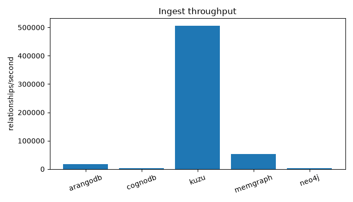

# Benchmark Results

Auto-generated by `src/report.py` from `results/*.json`. Re-run the report script after re-running benchmarks rather than editing this by hand.

## Data Loading

| Platform | Nodes/s | Rels/s | Total load time (s) |
|---|---|---|---|
| arangodb | 8082.4 | 16786.8 | 14.124 |
| cognodb | 3251.6 | 2994.0 | 71.942 |
| kuzu | 181699.4 | 506664.4 | 0.494 |
| memgraph | 76813.8 | 53699.7 | 3.934 |
| neo4j | 989.2 | 2374.7 | 102.402 |

## Traversal latency (ms)

### 1-hop

| Platform | p50 (ms) | p95 (ms) |
|---|---|---|
| arangodb | 0.873 | 1.278 |
| cognodb | 252.743 | 260.813 |
| kuzu | 3.915 | 7.003 |
| memgraph | 0.551 | 1.879 |
| neo4j | 17.698 | 104.091 |

### 2-hop

| Platform | p50 (ms) | p95 (ms) |
|---|---|---|
| arangodb | 0.966 | 2.199 |
| cognodb | 253.01 | 270.101 |
| kuzu | 4.683 | 6.587 |
| memgraph | 0.653 | 4.02 |
| neo4j | 33.971 | 111.53 |

### 3-hop

| Platform | p50 (ms) | p95 (ms) |
|---|---|---|
| arangodb | 2.191 | 20.617 |
| cognodb | 252.846 | 286.2 |
| kuzu | 3.562 | 9.895 |
| memgraph | 0.71 | 4.416 |
| neo4j | 48.797 | 110.621 |

## Lookups (ms)

| Platform | Point p50 | Point p95 | Filtered p50 | Filtered p95 |
|---|---|---|---|---|
| arangodb | 0.79 | 0.967 | 0.902 | 0.962 |
| cognodb | 251.987 | 253.121 | 268.24 | 273.291 |
| kuzu | 0.259 | 0.278 | 0.92 | 1.009 |
| memgraph | 0.326 | 0.559 | 2.101 | 3.092 |
| neo4j | 7.031 | 84.601 | 18.155 | 84.867 |

## Aggregation (ms)

| Platform | p50 (ms) | p95 (ms) |
|---|---|---|
| arangodb | 10.961 | 62.672 |
| cognodb | 279.593 | 295.695 |
| kuzu | 3.324 | 3.597 |
| memgraph | 5.642 | 55.801 |
| neo4j | 97.618 | 196.926 |

## Mixed read/write throughput (qps)

| Platform | 10_clients | 1_clients | 40_clients |
|---|---|---|---|
| arangodb | 1474.57 | 1223.27 | 1446.23 |
| cognodb | 40.03 | 4.0 | 160.4 |
| kuzu | 761.8 | 776.47 | 776.67 |
| memgraph | 1154.67 | 1231.6 | 1233.33 |
| neo4j | 113.87 | 56.7 | 162.37 |

## Footprint

- **arangodb**: `{'nodes_collection_stats': {'indexes': {'count': 3, 'size': 1299151}, 'documents_size': 1521573, 'cache_in_use': False, 'cache_size': 0, 'cache_usage': 0}}`
- **cognodb**: `{'nodeCount': 18772, 'note': 'counted via MATCH, APOC not available'}`
- **kuzu**: `{'on_disk_bytes': 10862592, 'note': 'embedded - no separate server process to inspect'}`
- **memgraph**: `{'nodeCount': 18772, 'note': 'counted via MATCH, APOC not available'}`
- **neo4j**: `{'nodeCount': 18772, 'note': 'counted via MATCH, APOC not available'}`